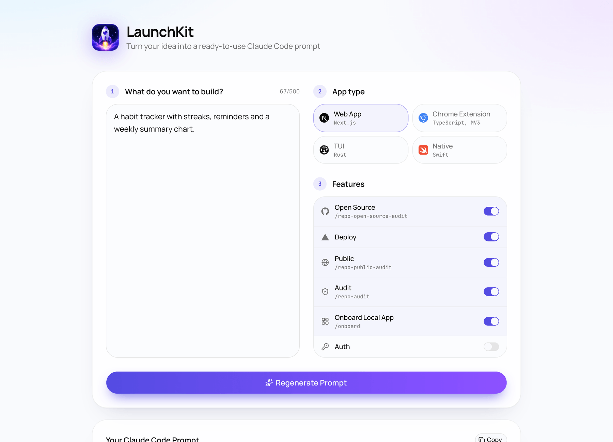
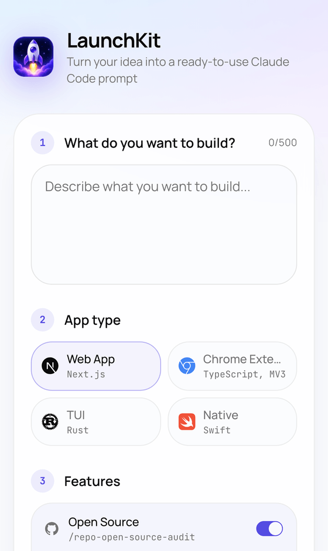
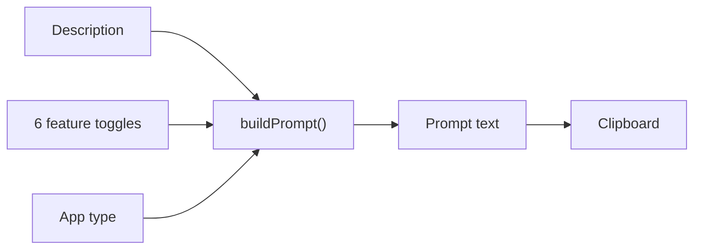

# LaunchKit

Describe an app in a sentence, flip a few toggles, and get a structured Claude Code prompt you can paste straight into a terminal.



[](LICENSE)
[](https://github.com/bunlongheng/launchkit/actions/workflows/ci.yml)


## Contents

- [Why](#why)
- [Features](#features)
- [Architecture](#architecture)
- [Design decisions and trade-offs](#design-decisions-and-trade-offs)
- [Tech stack](#tech-stack)
- [Quick start](#quick-start)
- [Configuration](#configuration)
- [Project layout](#project-layout)
- [Tests](#tests)
- [License](#license)

## Why

A one-line request like "build me a habit tracker" leaves an agent guessing about
quality bars, deployment, licensing and whether to touch the existing repo. Writing the
full brief by hand every time is tedious and easy to get wrong.

LaunchKit keeps the boilerplate half of that brief in one place. You supply the idea and
the 3 or 4 choices that actually vary; it assembles the rest.

## Features

- Describe the app in up to 500 characters, with a live character counter.
- 6 toggles that each change the prompt in a real way: Open Source, Deploy, Public or
  Private, Audit, Onboard Local App and Auth. 5 of them add their own guidance section.
  Everything ships on except Auth, since far from every app needs a login.
- 4 of those toggles map to a real Claude Code skill, shown on the switch and emitted
  as a numbered run order at the end of the prompt: `/onboard`, `/repo-audit`,
  `/repo-public-audit` and `/repo-open-source-audit`.
- Pick an app type and the stack comes with it: Web App on Next.js, Chrome Extension
  on TypeScript and MV3, TUI on Rust, Native on Swift. Each carries its own mark.
- The output pane stays out of the way until you generate, then reveals below the form
  and scrolls itself into view.
- Read the assembled prompt in a monospace pane and copy it with 1 click.
- Change a setting after generating and the pane flags itself as out of date, so you
  never copy a prompt that no longer matches the form.
- Keyboard and screen reader friendly: the stack selector is a real radiogroup with
  arrow-key navigation, every toggle is a labelled switch, and copy results are
  announced.



## Architecture

3 layers, and the dependency only ever points downward. The page is a server component
that renders 1 stateful client component; that component owns the form state and calls a
pure function to turn it into text. There is no server code, no database and no network
call at runtime, so the whole site prerenders to static files.



| Layer | Lives in | Responsibility |
|-------|----------|----------------|
| Page | `app/` | Metadata, fonts, icons, manifest, and the static shell |
| UI | `components/` | Form state, rendering, accessibility |
| Domain | `lib/buildPrompt.ts` | Turning settings into prompt text. Pure, no DOM |

## Design decisions and trade-offs

| Decision | Chosen | Alternative | Why this trade-off | Cost we accept |
|----------|--------|-------------|--------------------|----------------|
| Prompt assembly | A pure function in `lib/` | Build the string inside the component | Testable with `node:test` and no browser | 1 extra module for a small app |
| Rendering | Fully static, no server | An API route that returns the prompt | Nothing to secure, scale or pay for | The rules ship to the client, so they are public |
| Generating | An explicit button | Re-render the prompt on every keystroke | The output is meant to be read and copied, not to flicker | Needs a staleness signal, which the pane provides |
| UI primitives | shadcn on `@base-ui/react` | Hand-rolled switches and radios | Correct ARIA and focus behaviour for free | A build-time dependency |
| Content Security Policy | `script-src 'unsafe-inline'` | A nonce-based policy | A static export cannot run per-request middleware | Accepted because the app renders no user-supplied HTML |

## Tech stack

- Next.js 16 App Router, React 19, TypeScript in strict mode
- Tailwind CSS v4 with shadcn components built on `@base-ui/react`
- `lucide-react` icons, Manrope and JetBrains Mono via `next/font`
- `node:test` for unit tests, Playwright for the end-to-end flow
- Hosted on Vercel, with GitHub Actions running every check on push

## Quick start

Requires Node 22.6 or newer, since the test runner strips TypeScript types natively.

```bash
git clone https://github.com/bunlongheng/launchkit.git
cd launchkit
npm install
npm run dev
```

Open http://localhost:3046.

## Configuration

| Env var | Default | Purpose |
|---------|---------|---------|
| `NEXT_PUBLIC_SITE_URL` | `https://launchkit-bheng.vercel.app` | Canonical origin for canonical links, Open Graph tags and the web manifest |

Optional. Everything else runs with no configuration at all.

## Project layout

```
app/
  page.tsx              # server component: header plus the builder
  layout.tsx            # fonts, metadata, Open Graph, manifest
  manifest.ts           # web app manifest for home-screen install
  globals.css           # theme tokens and the 2 page animations
  icon.png              # 512 web icon, also the header mark
  apple-icon.png        # 180 touch icon, flattened for the iOS mask
  opengraph-image.jpg   # 1200x630 share card
components/
  AppBuilder.tsx        # the only stateful component
  BrandIcons.tsx        # generated: official GitHub, Vercel, Next.js, Chrome, Rust, Swift marks
  DescriptionField.tsx  # textarea plus character counter
  FeatureToggles.tsx    # the 6 switches, each with its mark and skill command
  AppTypeSelector.tsx   # 4 app types, each with its mark and implied stack
  PromptPreview.tsx     # output pane, copy button, staleness pill
  StepLabel.tsx         # numbered section heading
  ui/                   # shadcn primitives
lib/
  buildPrompt.ts        # the entire domain: settings in, prompt out
scripts/
  brand-icons.mjs       # regenerates BrandIcons.tsx from simple-icons
tests/
  buildPrompt.test.ts   # unit coverage of the prompt rules
e2e/
  prompt.spec.ts        # generate, copy, staleness, keyboard
```

## Tests

```bash
npm run typecheck   # tsc, sources and tests
npm run lint        # eslint
npm test            # node:test unit suite
npm run test:e2e    # Playwright, boots the dev server itself
```

Point `E2E_BASE_URL` at a deployed URL to run the same end-to-end suite against it.

## License

[MIT](LICENSE) (c) Bunlong Heng
